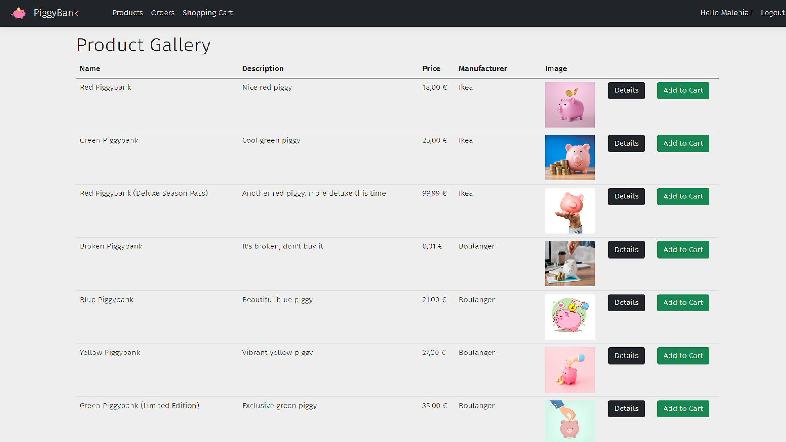
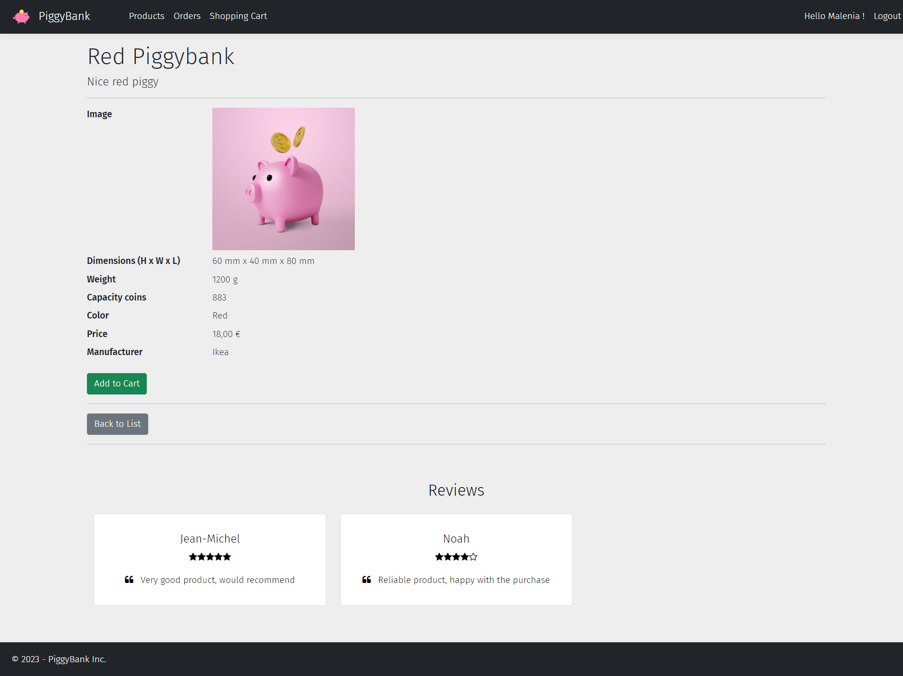
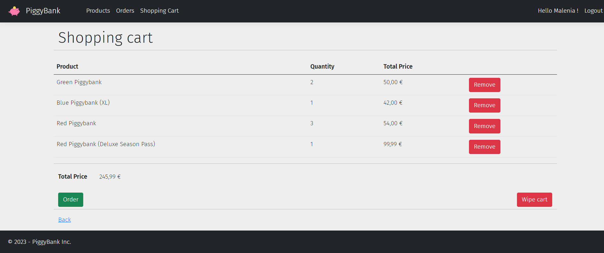
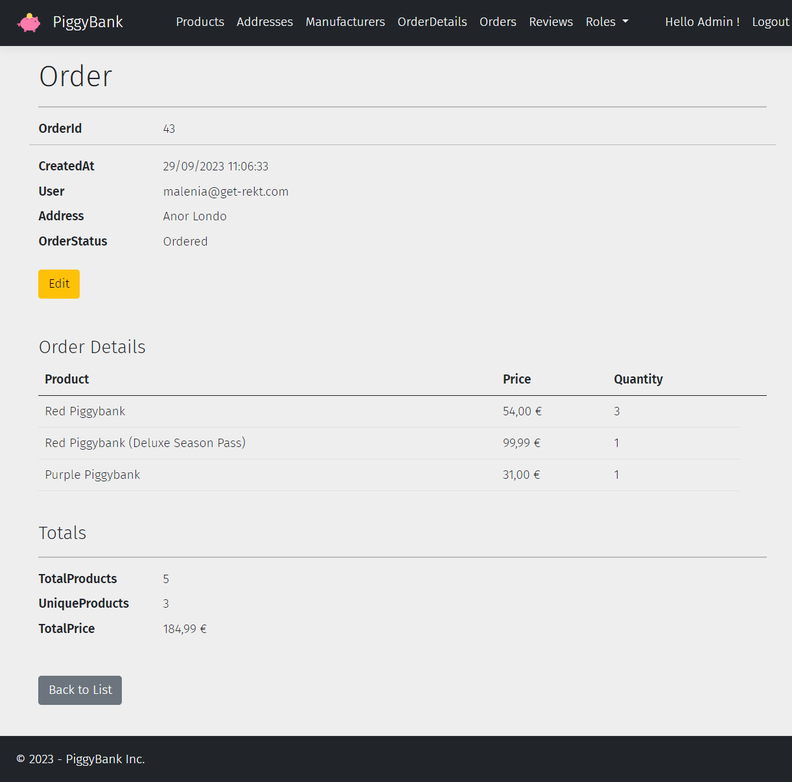
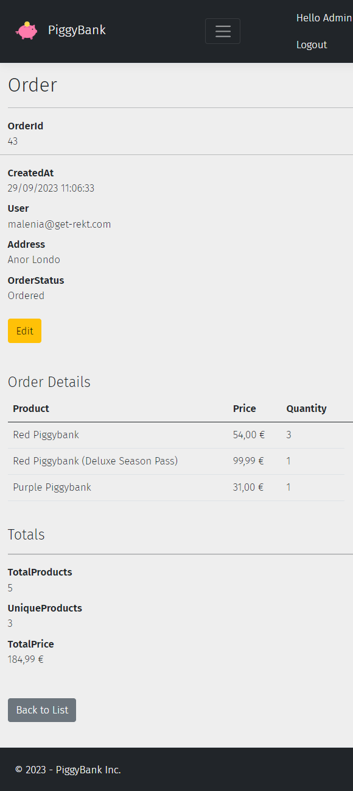
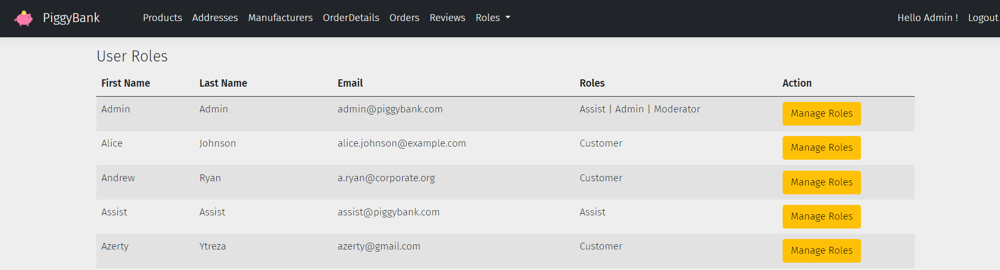

# PiggyBank

E-commerce website made during Global Knowledge training. Functionalities include :

- Authentication : 
  - Register + Password verification
  - Login
  - Password Recovery through email
- Shopping :
  - Browse the product gallery
  - Check a product details
  - Adding products to a shopping cart
  - Checkout the shopping cart into an actual order
  - Add a review to a product that you bought
- Admin Panel : 
  - Change any user's roles
  - Edit / hide products
  - Edit order status (*Packaged*, *Delivered*, etc ...)
  - Add manufacters into the database

 

---

 

### Made using :
- C#
- [.NET Core](https://dotnet.microsoft.com/en-us/download)
- [ASP.NET MVC](https://dotnet.microsoft.com/en-us/apps/aspnet/mvc)
- [Entity Framework Core](https://github.com/dotnet/efcore)
- [Identity](https://learn.microsoft.com/en-us/aspnet/core/security/authentication/identity?view=aspnetcore-7.0&tabs=visual-studio)
- [MS SQL Server](https://www.microsoft.com/en-us/sql-server)
- [Bootstrap](https://getbootstrap.com/docs/5.1/getting-started/introduction/)

 

---

 

##### Product Gallery

##### Product Details

##### Shopping Cart

##### Orders
<!--  -->

##### Admin Panel

 